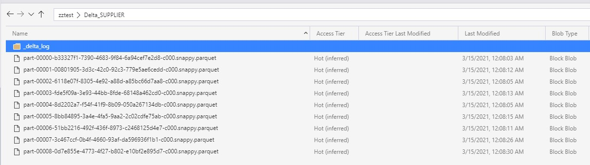
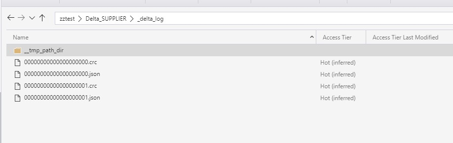
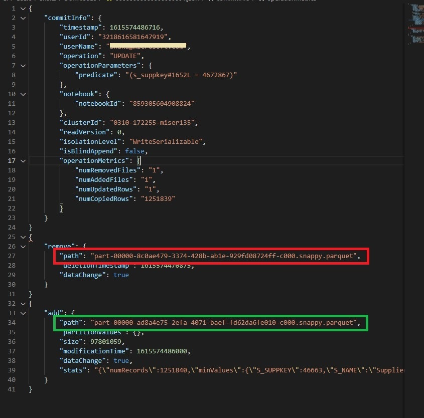
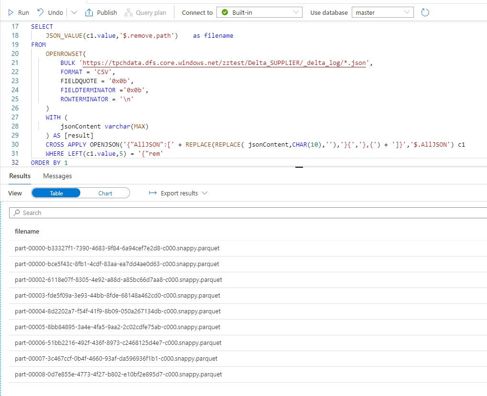
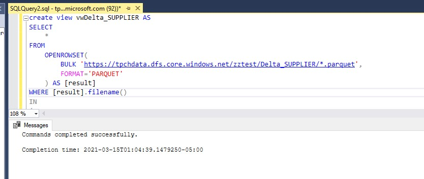
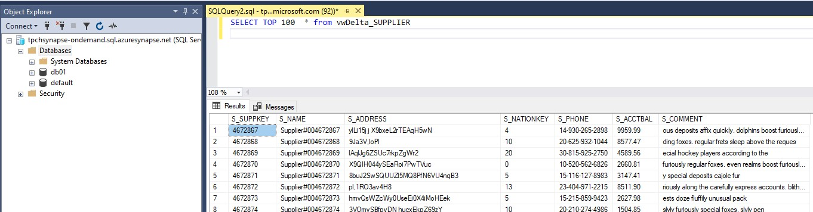

## Synapse serverless supports reading data from CSV,JSON and Parquet files today. It currently does not support reading data from [Delta.IO](https://delta.io/) tables from ADLS Gen2,  its in the roadmap and there will be native support to read Delta tables directly from SQL serverless in the future.


### Delta has open storage layer and it uses basic parquet files with [versioning](https://docs.delta.io/latest/delta-faq.html#what-format-does-delta-lake-use-to-store-data) capability added on top of it.  Since its an open format, here is my attempt to read a Delta table usign SQL serverless.

First let us understand how Delta organizes its parquet data files and JSON logs files.  This will help us in building a serverless query.

For example,

If you insert 100 thousand rows into a Delta table, all those rows will be split across and saved into multiple parquet files as below.



If you issue an "UPDATE" command on the Delta table that changes one of the rows, you will see that delta marks the parquet file that has this row data as inactive and creates a new parquet data file with the updated row in it.
The file that is highlighted in RED is marked as inactive and a new file highligthed in GREEN is added


All the information about the files that are marked as inactive and the new files that are added are kept in a JSON file in the "_delta_log" folder.



Sample contents of one of the log files "00000000000000000001.json" that shows the list of parquet files that are inactivated and the newly added files.




The first part of the serverless SQL query is to find the list of files added and removed and then find out the currently active files.  The below serverless query with with few JSON parsing tricks can get us this info.

```sql
SELECT 
	JSON_VALUE(c1.value,'$.add.path')    as filename
FROM
    OPENROWSET(
        BULK 'https://tpchdata.dfs.core.windows.net/zztest/Delta_SUPPLIER/_delta_log/*.json',
        FORMAT = 'CSV',
        FIELDQUOTE = '0x0b',
        FIELDTERMINATOR ='0x0b',
        ROWTERMINATOR = '\n'
    )
    WITH (
        jsonContent varchar(MAX)
    ) AS [result]
	CROSS APPLY OPENJSON('{"AllJSON":[' + REPLACE(REPLACE( jsonContent,CHAR(10),''),'}{','},{') + ']}','$.AllJSON') c1
WHERE LEFT(c1.value,5) = '{"add'
	EXCEPT
SELECT 
	JSON_VALUE(c1.value,'$.remove.path')    as filename
FROM
    OPENROWSET(
        BULK 'https://tpchdata.dfs.core.windows.net/zztest/Delta_SUPPLIER/_delta_log/*.json',
        FORMAT = 'CSV',
        FIELDQUOTE = '0x0b',
        FIELDTERMINATOR ='0x0b',
        ROWTERMINATOR = '\n'
    )
    WITH (
        jsonContent varchar(MAX)
    ) AS [result]
	CROSS APPLY OPENJSON('{"AllJSON":[' + REPLACE(REPLACE( jsonContent,CHAR(10),''),'}{','},{') + ']}','$.AllJSON') c1
	WHERE LEFT(c1.value,5) = '{"rem'

```

Result of the above SQL query



The final SQL query to read the delta table is as below. Note the  IN and Sub query 
```sql
SELECT
        [result].*
FROM
    OPENROWSET(
        BULK 'https://tpchdata.dfs.core.windows.net/zztest/deltatable03/*.parquet',
        FORMAT='PARQUET'
    ) AS [result]
WHERE [result].filename()  IN 
(
    <<List of Active File Name from the previous query>>
)
```

Once we replace the subquery with the query that get the list of active files,the final query will look as below.


```sql
SELECT
    *
FROM
    OPENROWSET(
        BULK 'https://tpchdata.dfs.core.windows.net/zztest/Delta_SUPPLIER/*.parquet',
        FORMAT='PARQUET'
    ) AS [result]
WHERE [result].filename() 
IN 
(
    SELECT 
    JSON_VALUE(c1.value,'$.add.path')    as filename
FROM
    OPENROWSET(
        BULK 'https://tpchdata.dfs.core.windows.net/zztest/Delta_SUPPLIER/_delta_log/*.json',
        FORMAT = 'CSV',
        FIELDQUOTE = '0x0b',
        FIELDTERMINATOR ='0x0b',
        ROWTERMINATOR = '\n'
    )
    WITH (
        jsonContent varchar(MAX)
    ) AS [result]
    CROSS APPLY OPENJSON('{"AllJSON":[' + REPLACE(REPLACE( jsonContent,CHAR(10),''),'}{','},{') + ']}','$.AllJSON') c1
WHERE LEFT(c1.value,5) = '{"add'
    EXCEPT
SELECT 
    JSON_VALUE(c1.value,'$.remove.path')    as filename
FROM
    OPENROWSET(
        BULK 'https://tpchdata.dfs.core.windows.net/zztest/Delta_SUPPLIER/_delta_log/*.json',
        FORMAT = 'CSV',
        FIELDQUOTE = '0x0b',
        FIELDTERMINATOR ='0x0b',
        ROWTERMINATOR = '\n'
    )
    WITH (
        jsonContent varchar(MAX)
    ) AS [result]
    CROSS APPLY OPENJSON('{"AllJSON":[' + REPLACE(REPLACE( jsonContent,CHAR(10),''),'}{','},{') + ']}','$.AllJSON') c1
    WHERE LEFT(c1.value,5) = '{"rem'
)


```

If you want to try the below query with your own delta tables, please note that you need to find the below ADLS gen2 path and replace it with your folder path (in 3 places)

https://tpchdata.dfs.core.windows.net/zztest/Delta_SUPPLIER


If you want to make this easier for your end users to access delta tables via SSMS or other tools, you may want to create this SQL query as view in an user database in SQL serverless as below.



End users can query this view directly from Synapse Studio,SSMS or other client tools




# Query Cost

Here is the dataset that i used for documenting the query performance.
Item | Value
--|--:|
Number of rows | 10,000,000
Total Data files in ADLS |10
Total Data Volume |837 MB
Number of versions | 2

Query|Rows Returned |Query Duration (Seconds)| Size of Data Scanned | Size of Data Moved | Size Data Written | Total Data Processed | Query Cost USD (1TB=5$)
--|--:|--:|--:|--:|--:|--:|--:|
SELECT TOP 100  * FROM vwDelta_SUPPLIER |100|16|220 mb|1 mb|0 mb|221 mb|0.001054 $
SELECT TOP 100  * FROM vwDelta_SUPPLIER  WHERE S_SUPPKEY = 4672879 |1|16|884 mb|1 mb|0 mb|885 mb|0.004220 $
SELECT S_NATIONKEY,COUNT(*) FROM vwDelta_SUPPLIER  WHERE S_ACCTBAL < =0 GROUP BY S_NATIONKEY|25|21|60 mb|1 mb|0 mb|61 mb|0.000291 $
SELECT COUNT(*) FROM [dbo].[vwDelta_SUPPLIER]|1|3|3 mb|1 mb|0 mb|4 mb|< 0.000001


# Benefits
There are few key reasons why the ability the read delta tables from [Synapse SQL severless](https://docs.microsoft.com/en-us/azure/synapse-analytics/sql/on-demand-workspace-overview) is gong to be an important feature.
*   Synapse SQL serverless has  ["pay per query"](https://azure.microsoft.com/en-us/pricing/details/synapse-analytics/) billing model, there is no need to have a Spark cluster running to read the data.  
*   With Spark clusters, there is always a startup time associated with the cluster, this could be anywhere between 5-15 minutes.  
*   The size of the spark cluster needs to be estimated and provisioned upfront. The cluster that is perfectly sized to run a smaller query might not be the optimal one to execute larger queries (and vice versa). Synapse serverless automatically allocated the compute required based on the query complexity. As as user, you do no need to worry about the compute sizing.
*   Every Synapse serverless query gets it own independent compute, so you do no need to worry about concurrent user query and sizing needed for them.
*   SQL Server supports wide variety of 3rd pool to connect and query them.  Any tool that works with SQL server can seamlessly connect to Synapse SQL Serverless.


Please give this approach a try and let me know if you run into any issues with this, here are few things to note
*   I noticied that the SQL serverless "[result].filename()  IN " clause seems to  apply the filters after it reads the data, so you may notice a slightly higher amount of data processed for the query, which in turn may increase the query cost.  I am investigating options to see if this can be reduced further.
*   I tried a slightly different variation of this query that uses ".filename NOT IN" approach that slighty reduced the data scanned volume, the query can be found here \synapse_serverless_query folder
*   I havent tested if this approach handles the schema drift of the Delta schema

